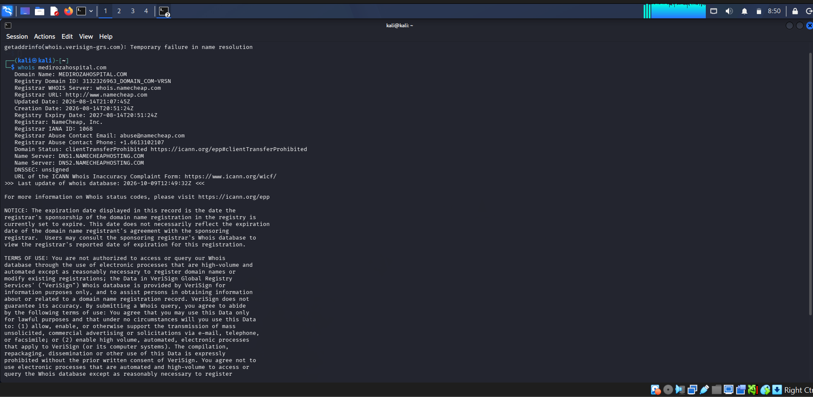
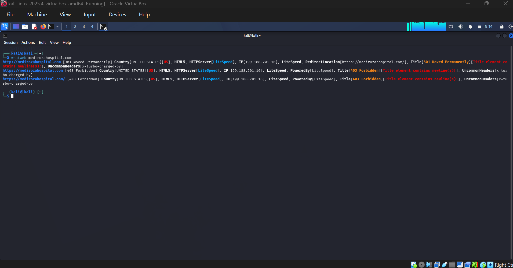
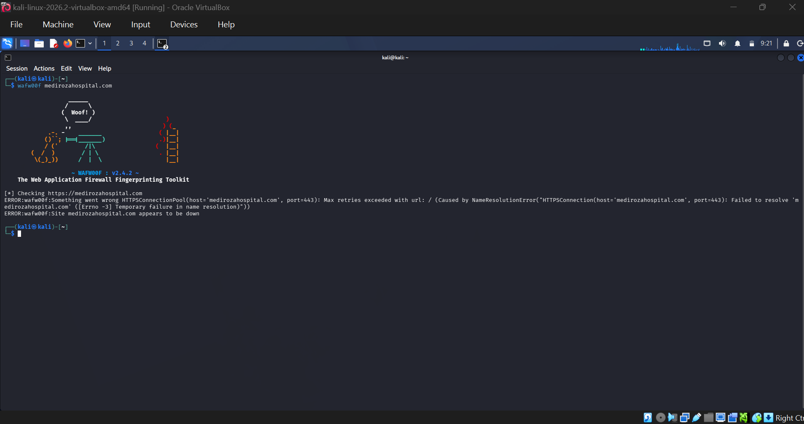

# NETWORKWALKS-B083A-WK4-WEB-APPLICATION-PENETRATION-TEST
A full penetration test against Mediroza General Hospital

# Penetration Testing Report on Mediroza General Hospital

|Client| Mediroza General Hospital |
|---------|-------------------------|
| Target | https://medirozahospital.com/|
| Target IP | 199.188.201.16 |
| Assessment Type | Full black-box penetration test |
| Batch | B083A NetworkWalks |
|Duration |5 Days |
|Conducted by| Olaopa Dasola Deborah |
| Date | 09 October 2026 |
|Authorization| Written permission granted by client for this engagement|

## 1. Liability Disclaimer
This assessment was conducted in a controlled, authorized educational environment as part of the NetworkWalks Cybersecurity Internship. These techniques were not and must never be applied to any system without explicit written permission from the owner.

## 2. Introduction

This report documents a black-box penetration test performed against Mediroza General Hospital's web infrastructure. The engagement identified a critical authentication vulnerability in the login mechanism, which allowed unauthorized access to a restricted portal containing confidential documents and sensitive hospital data.

## 3. Objective
The project was grouped into four milestones
* M1: **Initial Access:** Attack the website to retrieve three confidential patient PDF lab reports.
* M2: **Data Extraction:** Crack the encryption on all the retrieved files.
* M3: **Attack (cracking):** Get staff salaries and shareholder details.
* M4: **Pentest Report:** Write a professional penetration testing report for the client

## 4. Milestone 1; Initial Access
The website was attacked and three confidential PDF laboratory reports were retrieved from the authorized lab environment.

### Reconnaissance (Footprinting)
The following footprintng tools were used to gather information about the target;
| Tool | Purpose | 
|------|---------|
| WHOIS | Gathered domaim registration details (owner, dates, name servers, registrar url) |
| WhatWeb | Identified technologies and web technologies used by the target |
| Wafw00f | Detects if a Web Application Firewall protects the site |
| nslookup | Performed DNS queries to identify relevant DNS information | 

### Patient Portal and Authentication Testing
The Patient Portal identified was tested during footprinting ;
https://medirozahospital.com/patient/login.php

An authentication attempt was also made and access was granted.
https://medirozahospital.com/patient/portal.php

The portal contained three encrypted patient laboratory reports.

**Scope:** Testing was limited to the target domain (medirozahospital.com) only. No social engineering, denial-of-service, or out-of-scope testing was performed, per the rules of engagement.

**Methodology:**
- Reconnaissance of the target application
- Enumeration of login behavior and error handling
- Testing for input validation weaknesses (SQL injection)
- Exploitation to demonstrate real-world impact
- Analysis of retrieved files for further data exposure
- Documentation of findings with evidence

**Tools used:** [List what you used — browser dev tools, Burp Suite, JTR/Johnny, NetworkWalks hash calculator, etc.]

## 3. Findings and Proof of Exploitation

### Finding 1: Username Enumeration via Inconsistent Error Messages
**Description:** The login form returns different error messages depending on whether a submitted username exists ("Username not found" vs. "Incorrect password"), allowing an attacker to enumerate valid accounts.

**Proof of Concept:**
| Username | Password | Response |
|---|---|---|
| `bob` | `test123` | Username not found |
| `admin` | `test123` | Incorrect password |

**Impact:** Confirms `admin` is a valid account, narrowing the attack surface for further exploitation.

---

### Finding 2: SQL Injection in Login Form (Authentication Bypass)
**Description:** The username field does not sanitize user input before passing it into a SQL query, allowing an attacker to manipulate the query logic.

**Proof of Concept:**
