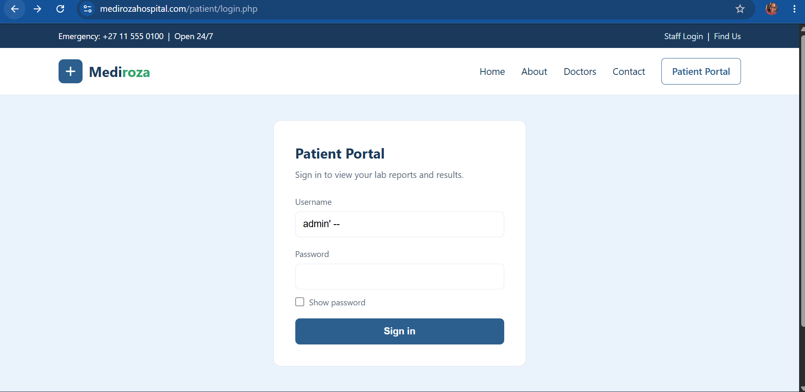
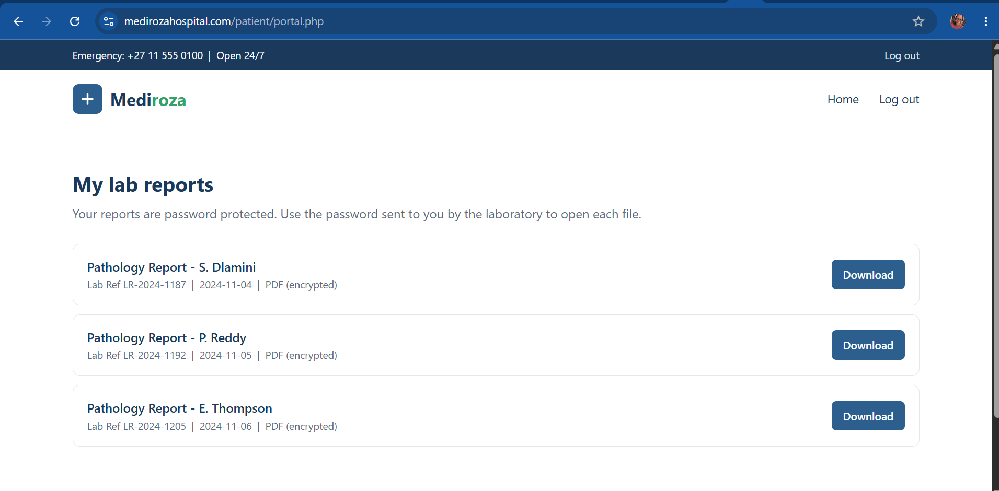
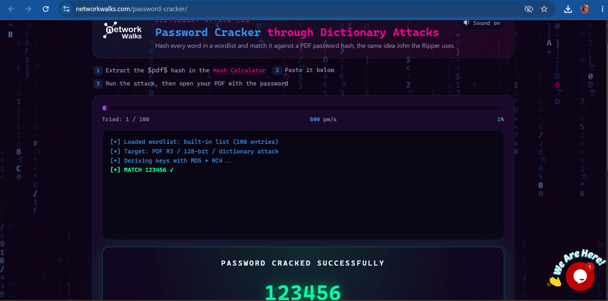
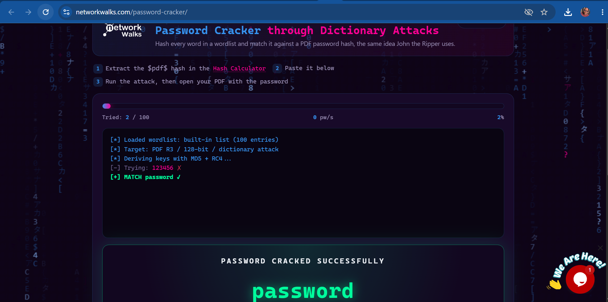
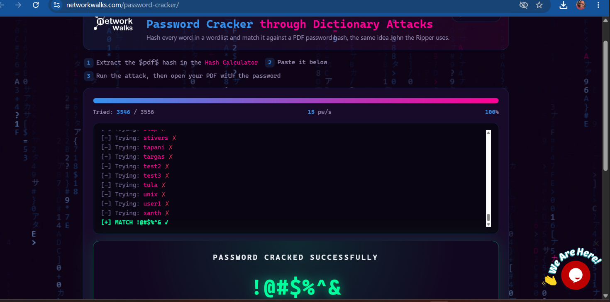
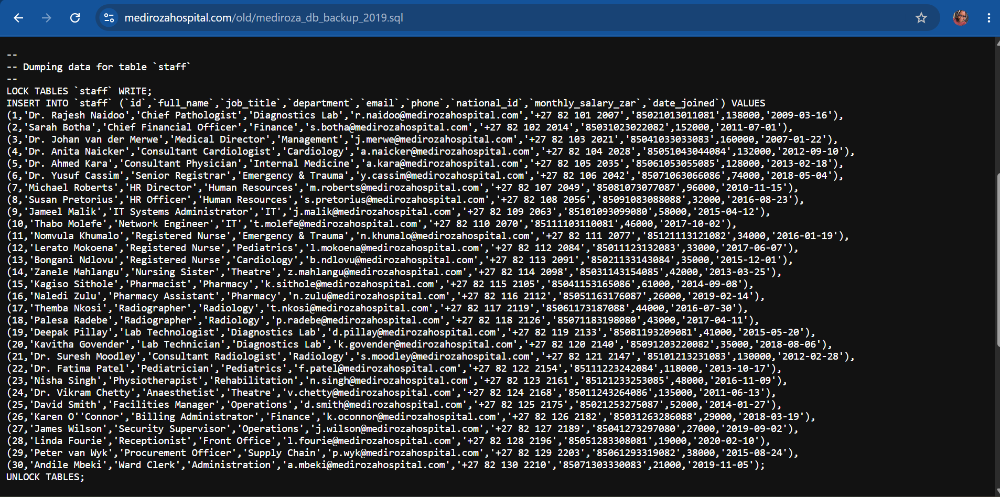
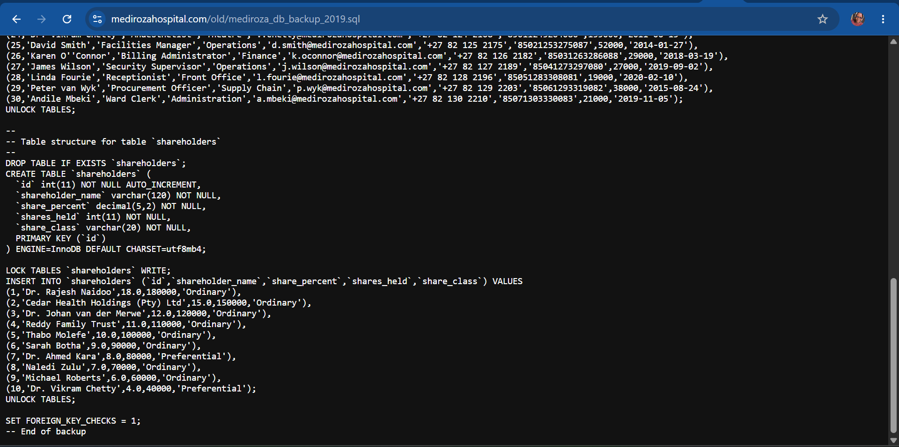

# NETWORKWALKS-B083A-WK4-WEB-APPLICATION-PENETRATION-TEST
A full penetration test against Mediroza General Hospital

# Penetration Testing Report on Mediroza General Hospital

|Client| Mediroza General Hospital |
|---------|-------------------------|
| Target | https://medirozahospital.com/|
| Target IP | 199.188.201.16 |
| Assessment Type | Full black-box penetration test |
| Batch | B083A NetworkWalks |
|Duration |5 Days |
|Conducted by| Olaopa Dasola Deborah |
| Date | 09 October 2026 |
|Authorization| Written permission granted by client for this engagement|

## 1. Liability Disclaimer
This assessment was conducted in a controlled, authorized educational environment as part of the NetworkWalks Cybersecurity Internship. These techniques were not and must never be applied to any system without explicit written permission from the owner.

## 2. Introduction

This report documents a black-box penetration test performed against Mediroza General Hospital's web infrastructure. The engagement identified a critical authentication vulnerability in the login mechanism, which allowed unauthorized access to a restricted portal containing confidential documents and sensitive hospital data.

## 3. Objective
The project was grouped into four milestones
* M1: **Initial Access:** Attack the website to retrieve three confidential patient PDF lab reports.
* M2: **Data Extraction:** Crack the encryption on all the retrieved files.
* M3: **Attack (cracking):** Get staff salaries and shareholder details.
* M4: **Pentest Report:** Write a professional penetration testing report for the client

## 4. Milestone 1; Initial Access
The website was attacked and three confidential PDF laboratory reports were retrieved from the authorized lab environment.

### Reconnaissance (Footprinting)
The following footprintng tools were used to gather information about the target;
| Tool | Purpose | 
|------|---------|
| WHOIS | Gathered domaim registration details (owner, dates, name servers, registrar url) |
| WhatWeb | Identified technologies and web technologies used by the target |
| Wafw00f | Detects if a Web Application Firewall protects the site |
| nslookup | Performed DNS queries to identify relevant DNS information | 

### Patient Portal and Authentication Testing
The Patient Portal identified was tested during footprinting ;
https://medirozahospital.com/patient/login.php

An authentication attempt was also made and access was granted.
https://medirozahospital.com/patient/portal.php

The portal contained three encrypted patient laboratory reports.

### Retrieved Patient Reports
After access got granted, I had access to My lab reports page.
The portal displayed; 

 1. Pathology Report — S. Dlamini
    Lab Ref: LR-2024-1187 | 2024-11-04 | PDF (encrypted)

 2. Pathology Report — P. Reddy
    Lab Ref: LR-2024-1192 | 2024-11-05 | PDF (encrypted)

 3. Pathology Report — E. Thompson
    Lab Ref: LR-2024-1205 | 2024-11-06 | PDF (encrypted)
Each report had a Download option.

## 5. Milestone 2; Data Extraction
**Objective** Crack the encryption/password protection on all three retrieved PDF files.

### Password Cracking Approach
After downloading the three encrypted patient reports, I used the NetworkWalks Hash Calculator to extract crackable hashes from the three encrypted PDFs.

Then after extracting the hashes, I used the NetworkWalks Password Cracker to recover the PDF passwords.

I tested the hashes against multiple wordlists.
The cracked passwords were:

| Patient PDF | Recovered Password |
| Patient-report-1.pdf | ****** |
| Patient-report-2.pdf | ******** |
| Patient-report-3.pdf | ******* |

Passwords for all three encrypted patient PDFs were cracked, allowing access to the protected files.

## 6. Milestone 3; Attack

Objective Find the staff salaries and shareholder details of the hospital.

This backup exposes every employee's personal data (names, national IDs, phones, salaries) and the hospital's shareholder register satisfying Milestone 3. No exploitation required.

It is important to note that, one should never store a database backup inside the web root. This single misconfiguration led to a full confidentiality breach.

## 7. Risk Summary
| Findings | Rating |
| Public database backup (staff PII, salaries, shareholders)  | Critical |
| SQL injection - authentication bypass | Critical |
| Weak encryption passwords on patient files | High |
| Directory listing enabled | Medium |
| Username enumeration on patient login | Medium |
| No Waf | Low |

## 8. What I Learned

* Reconnaissance or footprinting tools can reveal important details about a target before any further testing begings.
* Exposures and ccessible files or information, can create significant security risks.
* A targeted wordlist can be much more effective than a generic one when testing password security.
* Evidence and clear documentation are essential throughout a penetration testing.

# Tools & Resources
* Kali Linux
* NetworkWalks Hash Calculator: https://networkwalks.com/hash-calculator/
* NetworkWalks Password Cracker: https://networkwalks.com/password-cracker/

👤 **Author**
**Dasola Olaopa**
Cybersecurity Professional B083A

LinkedIn: https://www.linkedin.com/in/olaopadasola/

📌 **Project Information**
Program Name: Cybersecurity at NetworkWalks | Week: 04 |
Repository: GitHub

